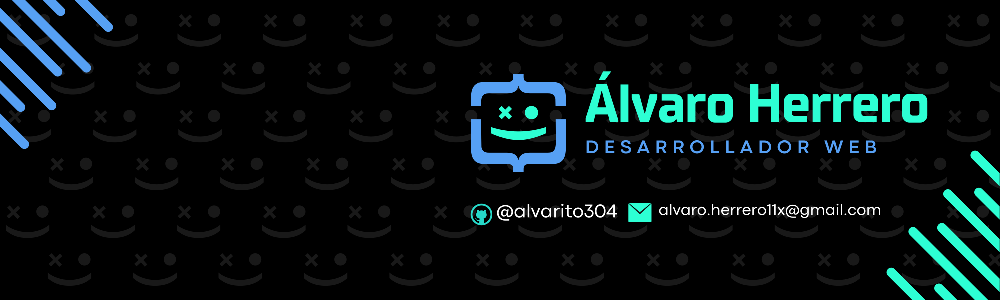
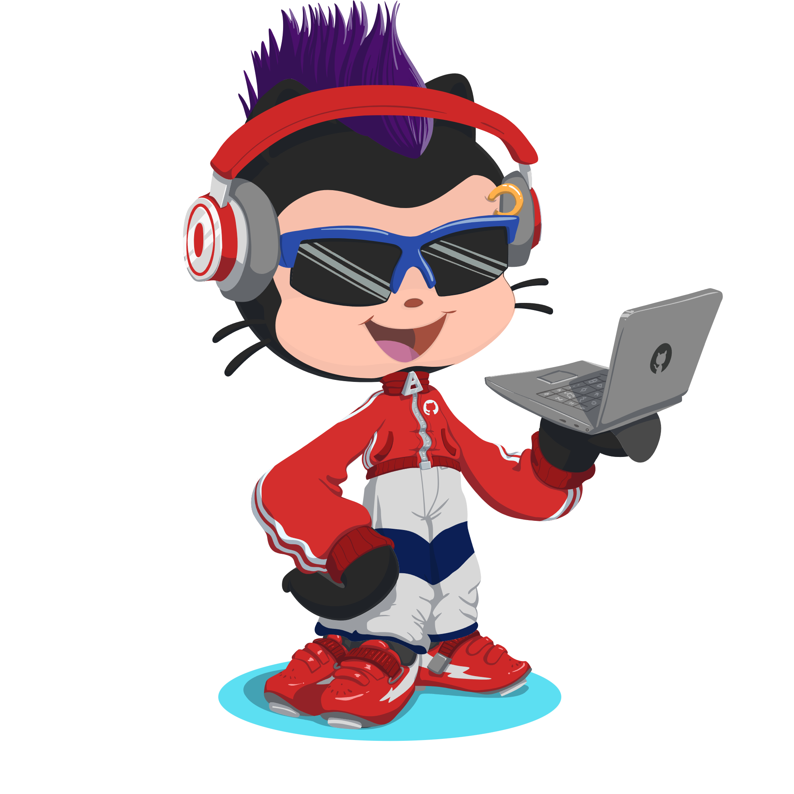

## Hola!! Bienvenido a mi perfil de Github!! 

&nbsp;
***About me***

Soy estudiante de **2º de DAW (Desarrollo de Aplicaciones Web)** y ya tengo el grado de **DAM (Desarrollo de Aplicaciones Multiplataforma)**.  
Me apasiona el aprendizaje constante y explorar nuevas tecnologías para avanzar como desarrollador full stack.  

🛠️ Tecnologías y lenguajes 

- **Lenguajes**: 

 

- **Frameworks y herramientas**:  
 
 
 
 
 
 
 
 
 
 

 

🌱 En proceso de aprendizaje 
Actualmente estoy aprendiendo **C#**, **.net**, **Spring** y **Angular** para mejorar mis habilidades técnicas con herramientas y frameworks modernos.  

💡 Intereses 
Me entusiasma:  
- Aprender continuamente 📚.  
- Desarrollar soluciones creativas 💡.  
- Trabajar en proyectos reales que impulsen mis habilidades 🚀.  

## 📫 ¡Conecta conmigo!  

